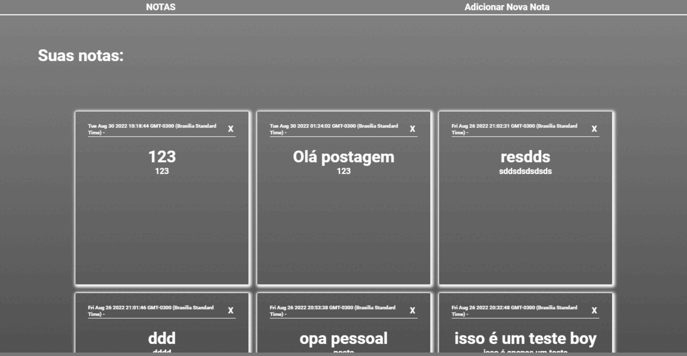

 <h1>Bloco de notas</h1>

 

### Este site foi criado para demonstrar meus conhecimentos em back-end, meu primeiro projeto do tipo!
### Foi utilizada as seguintes tecnologias:
+ NODE
+ MySQL
+ Handlebars

### Neste site é possível:
+ Criar notas
+ Visualizar as notas existentes
+ Apagar notas

